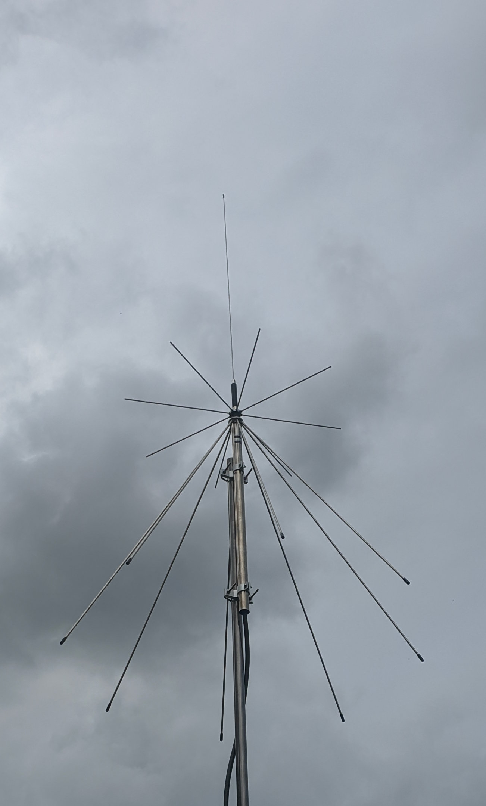

# Ground Station
This repository contains code and documentation for my custom satellite ground station. I use it to receive amateur satellite signals and weather satellites, like the following image from the NOAA 19 satellite:


### Hardware Components
My ground station uses a [Diamond D-3000 Discone 25-3000 MHz N](https://www.wimo.com/de/d-3000n) antenna, which means that I don't need a rotor.



For digitizing the signal, an [RTL-SDR Blog v4](https://www.ebay.de/itm/276000566513) and [its LNA](https://www.ebay.de/itm/283455455676) (powered via Bias-Tee) are used, connected to the antenna via a "LMR400 UF UltraFlex Equivalent" cable.

The groundstation software of this repo runs on a Raspberry Pi 5 Model B Rev 1.0, with 4 GB of RAM. The SDR is plugged into the Pi on a USB3 port.

### Software Setup
Here is an approximate description on how to make this software work.

#### Permanent OS Settings
Basically follow the instructions [for the RTL-SDR Blog V4 here](https://www.rtl-sdr.com/V4/), which also recommends disabling certain drivers. Basically, run the following command and reboot:

```
echo 'blacklist dvb_usb_rtl28xxu' | sudo tee --append /etc/modprobe.d/blacklist-dvb_usb_rtl28xxu.conf
```

Additionally, if the Raspberry Pi is connected via WIFI, set it to auto-reconnect forever:

```
nmcli connection show # find network
nmcli connection modify <network name> connection.autoconnect-retries 0 # <- forever
```

And it can also make sense to add these crontab entries (`sudo crontab -e`):

```
# Remove outdated recordings
@reboot rm -rf /tmp/recorder*
0 2 * * * find /tmp -maxdepth 1 -type d -name 'recorder*' -amin +1440 -exec rm -rf {} \;

# Reboot at night if we lost connection to the NAS
30 2 * * * if ! ping -c 5 <NAS hostname> > /dev/null 2>&1; then /sbin/reboot; fi

# Clear podman containers / build cache - also useful for normal user
0 0 * * * podman system prune -f --filter "until=336h"
0 0 * * * podman builder prune -f --filter "until=336h"
```

#### Installation
Some dependencies need to be installed for this all to work:

```
sudo apt update && sudo apt upgrade -y && sudo apt-get install -y podman zstd python3 python3-pip rtl-sdr
```

Next, build the containers for the device:

```
sudo ./setup.sh
```

Also, on the target device (Raspberry Pi), create this directory for GNU Radio:
```
mkdir -p /root/.config/gnuradio/prefs
```

#### Configuration

Configure a `.env` file to include the following values and put it into the root of this repository:

```
# Find out how to get one at https://www.n2yo.com/api/
N2YO_API_KEY=<API key>

# Location/coordinates
# e.g. for Berlin the values would be "52.518213" for lat, and "13.400230" for lon
LOCATION_LAT=<latitude>
LOCATION_LON=<longitude>
# Altitude above sea level in meters, e.g. "43"
# Can use e.g. https://vividmaps.com/elevation-finder/
LOCATION_ALT=<altitude of antenna at coordinates in meters over sea level>
```


#### Running the software

In the main repo directory, run this to actually run the groundstation:

```
sudo python auto/tracker.py
```

